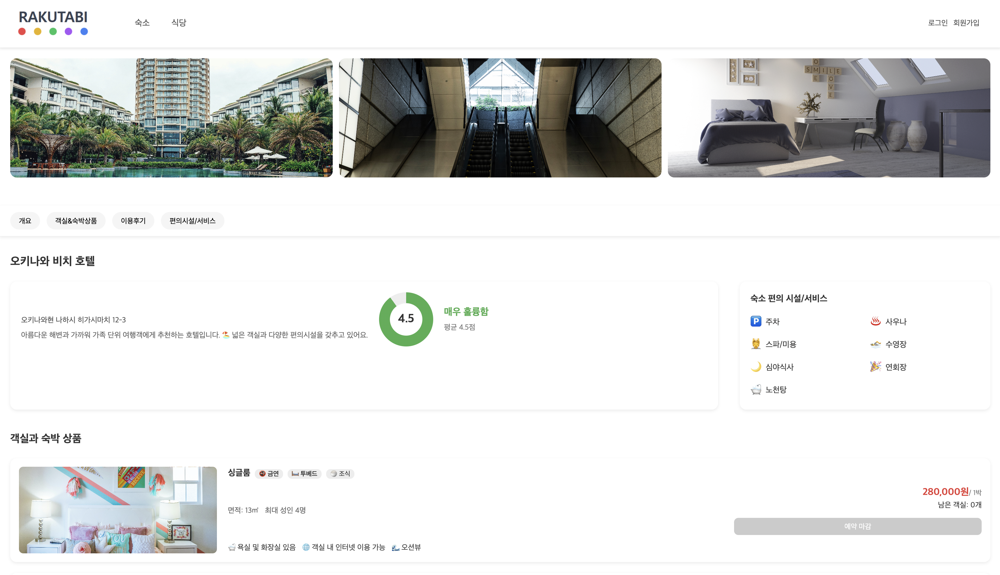

# 🏨 라쿠타비 (RAKUTABI)

일본 숙소 예약 사이트  
사용자는 원하는 숙소를 검색하고 예약할 수 있습니다.

---

## 💻 데모

🔗 [배포 링크](https://example.com)  
📸 (스크린샷 또는 GIF 추가 예정)

---

### 화면 예시


🏠 홈 화면에서는 숙소명,숙박기간,인원을 통해 숙소를 검색할 수 있습니다. 


💳 회원가입 화면에서는 아이디,비밀번호,닉네임,이메일,전화번호를 통해 회원가입을 할 수 있습니다.


👤 로그인 화면에서는 아이디,비밀번호를 입력하여 로그인 할 수 있습니다





## ✨ 주요 기능

- 숙소 목록 조회 및 상세 보기
- 숙소 예약 및 예약 관리
- 사용자 회원가입 / 로그인
- 사용자 마이페이지
- 식당 리뷰 목록 조회 및 상세 보기

---

## 🛠 기술 스택

- **Frontend:** React, Axios, React Router
- **기타:** CSS, HTML

---

## ⚙️ 설치 및 실행

```bash
# 저장소 클론
git clone https://github.com/username/rakutabi.git

# 패키지 설치
npm install

# 개발 서버 실행
npm run dev

---
```
## 👥 팀원 소개

|  |  |  |  |  |
|:---:|:---:|:---:|:---:|:---:|
| **최소윤** | **정유진** | **이종우** | **김근우** | **강일용** |
| 팀장 | 팀원 | 팀원 | 팀원 | 팀원 |
| [GitHub](https://github.com/sooyun3451) | [GitHub](https://github.com/levihisoka) | [GitHub](https://github.com/jongw0o0) | [GitHub](https://github.com/kimguenwoo) | [GitHub](https://github.com/tttt0817) |


